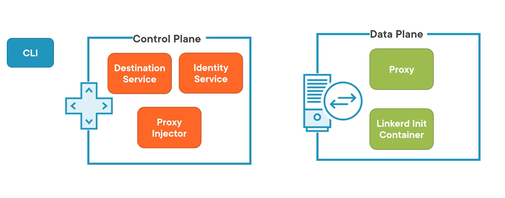

# Linkerd

Let's assume 
- Your company migrated to microservices from monolithic apps 
- **Microservices are Decentralized** :- It means there is a Network (HTTP) calls between services. 

- **Service Health** :- There is a lack of visibility, and it is affecting service health. Errors in latency are hurting the performance of services. 

## Service Mesh 
A service mesh is a dedicate infrastructure layer of facilitating service-to-service communications between services or microservices, using proxy. 

In simple words, a service mesh is a plumbing that cnnects our services together. The application make request and the service mesh handls those requests. 

## Why do we need a service mesh in a first place. 

The first adoopters of microservices, such as Netflix, Twitter, and Google, originally developed microservices without a service mesh.  
They realized that   
**Services are decentralized and communicate over HTTP** This architectue increases flexibility; however each service is an application, so each service has to handle making network calls to potentially hundreds of other services.

These early adopter started by creating code libraries that each service would use to gather metrics on latency and errors, as well as retries and timeouts. 

However, it soon became apperent that a **platform-base solution is the better option.** Forcing each application to use language-specific libraries eliminates the ability to build microservices in any languae that best suits it, Which is one of the main benefits of the technology. 

Service meshes abstract the network calls away from the applications. It allows the apps to grow independently of the network architecture and allows security, reliability, and observability to be built in and handled by the service mesh. Which is specifically designed for this purpose. 

The apps can focus on their main function, and the service mesh handles the networking. 

## Where Does Linkerd Fit? 
**Linkerd started as a project based on the Finagle library from twitter.** Twitter Used Finagle to handle the network calls for its services, but it is a JAVA library, meaning that al services had to be built in JAVA.   

Linkerd used Finagle as a base for its 1.0 release. However, It became clear that a new version was necessary and it was decided to rewrite the library from scratch using Rust and Go as the progaming language. It was also **donated to Cloud Native Computing Fondation, or CNCF.** 

**Linkerd is built to work with Kubernetes.** This focused use case allows Likerd to excel at what it does while remaining lightweight and imple to use. Your applications won't even know linkerd is there, allowing them to focus on what they do best. 

## Linkerd Architecture  
Let's discuss some peice of Linkerd first   
1. CLI :- Linkerd CLI is the tool you will use to administer Linkerd and tell it what to do. Think of it as kubectl for linkerd

2. Destination service :- This service provides API discovery services for Linkerd. It knows how to communicate with other services in the mesh, and proxies use it to find the right place to send requests. 

3. Identity Service :- The essential peice of Linkerd, This service is the certificate authority for linkerd. It issues certificates used to provide mutual TLS between services. 

4. Proxy injector :- The proxy injector is an admission controller that injects the linkerd to proxy and the init container into your pods. All you have to do is add a special annotation to your resource defination in kubernetes and, the proxy injector handles the rest. 

5. Proxy :- Linkerd2-proxy is the name of the proxy used by Linkerd. It's injected as a sidecar container into your Pods and intercepts all network calls made by the application. 

6. Linkerd Init Container :- The init container is injected along with the proxy. This cotainer updates the IP table's configuration, so all TCP requests from the pod flow through the proxy.

Lnkerd organizes these services into two groups 
- Control plane :- Destination Service, Identity Service, Proxy Injector
- data plane :- Proxy, Linkerd Init Container

## Let's see what proxies do 

Assume we have two pods managed by linkerd. Each pod contains the service container, the proxy, and the init container. Once the init container runs, It is shut down, leaving the proxy and the application.   

Suppose the service in Pod 1 needs to communicate with service in Pod 2 The service code makes a etwork call, as if no service mesh exists. The request is routed through the proxy. The proxy creates a connection with the proxy in POd 2. with mTLS enabled, this will be an HTTPS connection. The proxy in POd 2, then forward the request to the service in Pod 2.  

This architecture allows the proxy to handle everything related to network requests between services. The services aren't aware the proxy is doing anything. it's business as usual for them, but the important microservice practices such as mTLS, measurement, and fault handling are handled by he proxies. 

