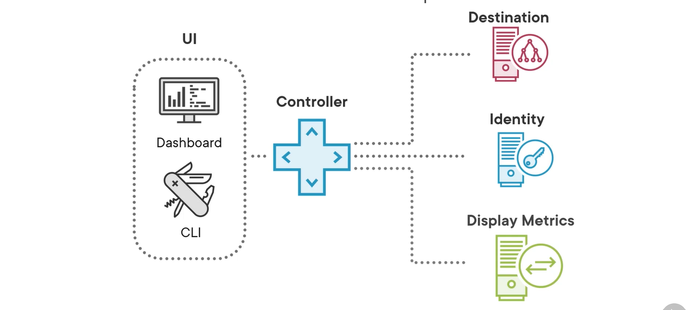
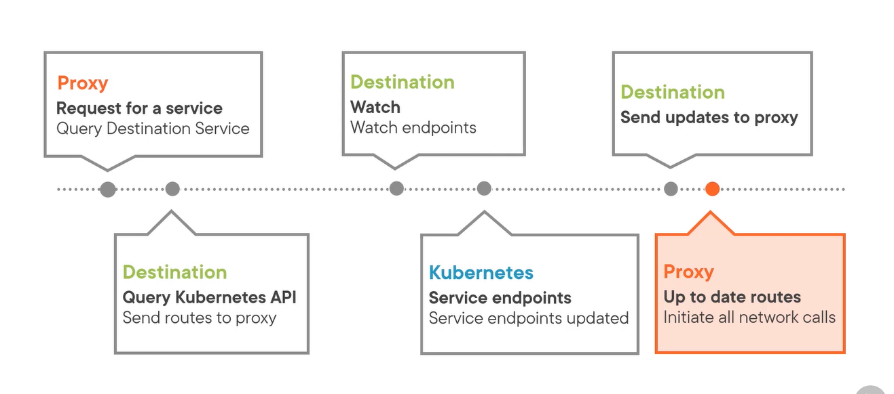
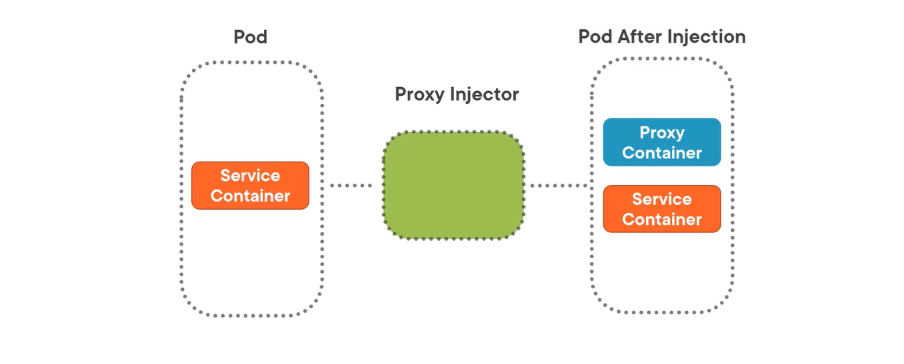
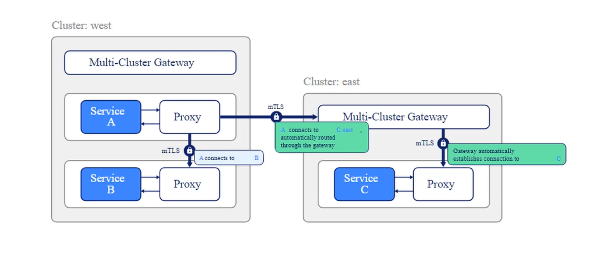

# Deep Dive into Linkerd Architecture. 

## Linkerd Data plane overview
- Pods that have the Linkerd3-proxy injected into their pods are reffered to as **meshed** pods.  
- These meshed pods communicate exclusively through the proxies. 
- This exclusive use of the proxies for the network requests allows the proxies to collect critical metrics about yur services, such as latency and error rates. 

## Four functions of the Data plane 
The data plane performs four functions for Linkerd and your meshed services.  

1. **Iptables Config :-** It uses Iptables to route traffic to the Linkerd2-proxy container. 
2. **Load Balancing :-** It performs load balancing for HTTP and gRPC traffic within your cluster. 
3. **Metrics :-** It gathers and display metrics about your services. 
4. **Mutual TLS :-** It ensures security by using mutual TLS to secure to secure communications between services. 

### Configuring iptables 
Configuring iptables is necessary to make sure all network calls between services are made through the proxy.   

There are two ways to configure iptables in Linkerd. 
1. **Init Container :-** 
- The default method is to use init container. and this container, called *proxy-init*, runs before all other containers within the pod and updates iptable before terminating.   

- This is simple process, but there is one possible complication. Configuring iptables requires the ``NET_ADMIN`` capability to be given to the user creating the pod.  

- In some environment giving the ``NET_ADMIN`` capability to every pod creator is not an option due to security reasons.

And that's why there is a second option to use if ``NET_ADMIN`` is not allowed and that's to use the **Linkerd CNI** plugin. 

2. **Linkerd CNI plugin :-**   
CNI plugins automatically run with elevated privileges. 
- So you no longer need to hand out the ``NET_ADMIN`` capability unnecessarily. 
- So if your environment doesn't allow the use of ``NET_ADMIN``, then the Linkerd CNI plugin is your best option.   

### Load Balancing 
One of Linkerd's most useful features is load balancing for your services. Kubernetes performs load balancing at connection level, meaning once the connection is established between pods, Kubernetes will continue to send requests along that same connection. 

- **Linkerd, load balances at a request level.**  
    * It maintains a connection pool, and then it can send each individual request along any connection it chooses. 
    * Linkerd balances requests based on latency using an exponentially weighted moving average algorithm. 
    * It continously monitorss the latency of each service and sends requests to the services with least latency. 

### Metrics Endpoint 
The use of proxies to create connections allows Linkerd to collect metrics around your services. 
- These metrics enable several necessary observability practices such as     
    * determining app health
    * collecting baseline metrics 
    * defining error budgets 
    * Creating service level objectives. 

- The cotrol plane collects key metrics from each proxy by way of a metrics endpoint. 
    * The default metrics endpoint is located on point **4191** on each proxy. ``http://localhost:4191/metrics``  
    * The metrics are stored in prometheus format. 
    * The control plane gather these metrics, aggregates them, and provide a portal for administrators to see them. And you have the option to use the Prometheus instance deployed with the control plane or one that you choose. 

### Mutual TLS  
The core security primitive of Linkerd is mutual TLS, or mTLS. 
- Linkerd provides connection-level encryption between services so sensitive data is always protected from prying eyes. 
- This archiecture always follows a zero-trust model. 
- There is a certificate on both side of the connection so the identity of each service can be validate before the request is sent.
- The proxy will establish and erminate TLS connections and validate the identity of each meshed pod automatically. 

## Linkerd Control plane 
The linkerd control plane is the command center. It monitors ccontrols, and reports on the data plane, allowing administrators such as yourself to control Linkerd'd functions. 

## Five components of Linkerd Control plane 
1. **Controller :-** It exposes API used to control Linkerd, either through the CLI or Linkerd dashboard. 
2. **Destination**
3. **Identity**
4. **Proxy Injector**
5. **Service Profile Validator**

### Controller 
The controller component in Linkerd exposes Linkerd's API to the outside world. 
- There are two ways to access the controller
    * The Linkerd Dashboard
    * The Linkerd CLI 
- The controller component provides the API endpoints used to display metrics and interact with other control plane component such as destination and identity. 
- The control plane also gather metrics from the endpoint of each proxy and display them to the administrator. 

### Destination 
The destination component serves as a service directory for Linkerd proxies.    

The abstract timeline showing the order of operations when proxies interact with the destination component.   

**Step 1 :-** The service makes a network request, which is routed through the proxy. The proxy queries the destination service on the control plane to determine the proper endpoint to send the request.   

**Step 2 :-** The destination component then queries the kubernetes API to gather the most up-to-date routes for the services within the cluster.   These routes are sent to the proxy, so the proxy can forward the rerequest.   

**Step 3 :-** The destination compoent sets up the watchers on the resources it received from the kubernetes API. and what these watchers mean is that the next time these service endpoints are updated, the destination component will then receive the update from Kubernetes. So if route canges for one of the services, th destination component will know that.   

**Step 4 :-** The destination component then send the updates to the proxies as they hapen, and then the destination service keeps the proxies up to date with the correct routes and endpoints, allowing the proxy to initiate network calls without worrying. If it doesn't have route, the process starts over with a query to the destination service endpoint, and a new watcher is placed. on that service. 

### Identity Component 
Another critical component of the control plane is the identity component.   
- The Identity component is responsible for generating certificates for proxies when they are created. 

- The process for it is :- 
    * The proxy creates a certificate signing request and sends it along with its service account token to the identity component via it's API endpoint. 
    * The identity service validates the token to verify the proxy's identity and then creates a certificate for that proxy. 
    * The identity component then sends the signed certificate back to the proxy for it to use. Each proxy requires a valid certificate to communicate with other proxies, as each side of the conection is verified by the other.  

The identity component ensures that this happens.

### Proxy Injector 
The proxy injector is a mutating webhook that adds the proxy container to meshed pods. You start with the resource defination of pod just like any other and add in the annotation i.e. 
> ``Linkerd.io/inject: enabled``   

The proxy injector will know that yo want to add the proxy to that resource. If you add an annotation to a namespace, all the pods within that namespace will be meshed, but you can also define it at a deployment level or even at an individual pod level. The lowes level wins. So if you add the enabled annotation to a namespace, you can prevent specific pods from becoming meshedd if you add the disabled annotation to a specific pod. 

The proxy injector will mutate each pod with the annotation to include the proxy container alongside the service the service container. 

### service profile Validator 

Service profile are the custom resource definations (CRDs) provided by Linkerd to provide metrics collection on individual routes. The service profile validator is a validating webhook that validates service profile definations before the resources are created. And if they aren't valid, service profiles are rejected, and an error message is displayed.

## Linkerd Extensions 
Linkerd extensions are the final piece of Linkerd's architecture. 

Extensions are distinct components added to the control plane to ad more functionality to it. 

By default, Linkerd ships with three extensions, Viz, Jaeger and Multi-cluster. 

- It is also possible to create extensions for linkerd, so the extension ecosystem could grow over time. 

### Viz extension 
viz extension provides the fnctionality needed to visualize the data collected by Linkerd's proxies.

There are four components of the Viz extension. 
1. Grafana builtin :- to provide built0in dashboards specifically for linkerd. A dynamic tempate is deployed every time a pod is injected with the Linkerd proxy, creating dashboards for you immediately. 

2. Prometheus instance :- The prometheus instance is included with linkerd, and it powers the dashboard and the CLI. By default this instance is configured to use an in-memory store and retains data for only 6 hours. also if the instance is restarted you will lose your data. So if you want long-term storage, you have to export these metrics to a separate deployment of Prometheus in your environment that is configured for long-term storage.   

3. Tap component :- Tap is an incredibly useful feature, especially when debugging. It displays real time request and response traffic between services. You can send queries to the Tap component to filter the traffic and display it on the dashboard or CLI or analysis. 

4. Web component :- Also known as linkerd dashboard. this is a web application written with Node.js and React. is the command center for linkerd, and it's where you will spend a lot of time as an administrator taking a look at the metrics gathered by linkerd. 

### Jaeger Extension  
jaeger is a n open source, end to end distributed tracing solution. The Jaeger extension for Linkerd allows you to access the power of Jaeger automatically. 

Components of Jaeger 
1. Jaeger :- Jaeger itself, its an all-in one image deployed to collect and display tracing information. You can use this built-in instance of jaeger, or you can swap it out with a centralized Jaeger instance if you've already set one up in yur environment. 

2. Collector :- This component colect information from the proxies and forwards it to jaeger instance. 

3. Jaeger-injector :- It configures the proxies to emit tracing information. 

These three works together to provide deep insights into the transactions and network traffic of your meshed pods. 

### Linkerd Multi-cluster 

It allows you to extend your service mesh between Kubernetes clusters. 

Each cluster has multi-cluster gateway, and this gateway mirrors kubernetes services between clusters and allows Linkerd to seamlessly connect to another cluster. 

In above diagram service A can send request to service C without even knowing that i's it different cluster. 

## Install Linkerd CLI and deploy to a cluster 

Follow this guide from Linkerd to setup this.  
[Setup Linkerd](https://linkerd.io/2.14/getting-started/)

# Gathering etrics Using Linkerd  

As our organization changed from monolith to microservices, and now they are running into some problems.  

1. They are running into latency isues and customers are complaining about services becoming slow and unresponsive. 
2. Some services are failing and returning error. 
3. Can't see into the microservice architecture to find out which services are working and which aren't. if request fails which service is the problem? Looking at mountains of logs from each service isn't practical or cost effective. 

## The "Golden Signals" of Microservices  
The term *"Golden signals"* comes from Google's site Relibility Engineering guidebook and has become the standard for observability in microservices. 

### Latency 
Latency is the time it takes for a service to respond to a request.   
The Linkerd proxy measures the time between the request and response from the service being called.   
The latency for a certain time period is typically measured as a statistical distribution, since each request has different times based on various factors.   
Latency is reported as the percentiles of this distribution.  
Latency reports common latency metrics such as **p50**, **p95** and **p99**, among others. Thee corresponds to the 50th, 95th and 99th percentiles of latency distribution. 

We can use latency of a service to help us to know a service may be having trouble keeping up with requests. 

### Error Rate 
The measure of failed requests.   
This signal helps us to identify services that may need immediate attention. Something could be seriously wrong if every request suddenly returns errors.    

Linkerd reports on success rate instead of the error rate; however, these are basically the same metrics just flipped around, so a 70% success rate means that there is a 30% error rate and vice-versa.   

For Linkerd, responses in the 200 range and 400 range are considered successful responses, while responses in the 500 range are marked as errors. This may seem counterintuitive, but makes sense. 

A 400-range response is sucessful because the server did as it was asked, but couldn't find the resource. This isn't an error. In fact, many REST services depend on this functionality. prior to creating a new resource, you may check to make sure the resource doesn't already exist. therefor, you want to see a 404 first before you create a resource to avoid duplicates. 

### Traffic volume 
Traffic volume measures the demand placed on a service. Linkerd reports on the requests per seconds, or RPS, based on the number of requests it proxies to an application.   

Linkerd provides two measures of traffic volume: **active** and **effective**  This is because Linkerd can automatically retry requests. The actual volume is mesured from te service perspective, while the effective volume is measured from the client's perspective, and these two measures help you build a more accurate picture of the demand placed on the service. 

## Installing Linkerd Dashboard 

Command 1 :- ``linkerd check`` To check weather likerd is installed and configure properly or not   

Command 2 :- ``linkerd viz install | kubectl apply -f -`` To install viz extension, This creates everything that is required to build Linkerd dashboard. 

Command 3 :- ``linkerd viz check`` to check the status of linkerd viz if it is installed or not. or still installing. 

viz extension gives us couples of different and useful tools but first and foremost it gives us the dashboard. 

To verify that the dashboard is there and that it has been installed successfully. in order to do that there is a very littke command called ``linkerd viz dashboard`` Now What is does is, it is going to port-forward, using kubectl it's going to port-forward automatically for us that'll forward our report to the dashboard web service. 

## Deploy emojivoto application on k8s and then we have to mesh it. 

Step 1 :- Install the application ``kubectl apply -f https://run/linkerd.io/emojivoto.yml``

Step 2 :- get everything from emojivoto ``kubectl get all -n emojivoto``  

Step 3 :- see it in linkerd dashboard :- ``linkerd viz dashboard``  

we can see in dashoard that we got the emojovoto dashboard but not a single pod is meshed. and as we discussed earlier to a pod be meshed we have to add annotation to our objects. We can do it by changing yaml file or by command. 

Step 4 :- let's annotate entire namespace ``kubectl annotate ns emojivoto linkerd.io/inject=enabled``  

This is not going to take effect immediately, to take effect we have to restart or deployments. 

Step 5 :- restart deployment in namespace emojivoto ``kubectl rollout restart deployment -n emojivoto``  

With the dployment retarted, Linkerd should inject the proxies into the Pods. And we can check that by checking out all the emojivoto pods, ``kubectl get pods -n emojivoto``  And we can see it there under READY it says 2/2. What that means i there is two containers in each pod. One is service container, the other one is the linkerd Proxy. 

Now we have emojivoto application deployed in the cluster and we have it meshed now with Linkerd, Linkerd proxies, which means we can now see the metrics. 

## Using Tap and stat commands 
It displays real time request and response traffic between services. You can send queries to the Tap component to filter the traffic and display it on the dashboard or CLI or analysis. 

**Whay do we use Tap?**  
Tap is really god in debugging, if a service or a deployment is having problems, you could also use Tap to figure out exactly which path is having problems. 

Tap command to see all traffic in the emojivoto nmespace from the web deployment, to the voting deployment.   
``linkerd viz tap deployment/web --namespace emojivoto --to deployment/voting --to-namespace emojivoto --path /emojivoto.v1.VotingSerice/VoteDoughnut``  

if we do not provide --path argument linkerd will query every possible path in the voting deployment.   
``linkerd viz tap deployment/web --namespace emojivoto --to deployment/voting --to-namespace emojivoto``  

**Reading the CLI Output**  
Reading the CLI output is little bit difficult so we can use output format as json using ``-o json`` it will give us the output in json format which is more human readable.   

``linkerd viz tap deployment/web --namespace emojivoto --to deployment/voting --to-namespace emojivoto --path /emojivoto.v1.VotingSerice/VoteDoughnut -o json``  

**stat command**  
stat command gives us the overall picture of the services, like if it is meshed or not, what is the success rate, It's latency, TCP connection etc. 

example stat commands :-

1. status of every deployment in the emojivoto namespace :- ``linkerd viz stat deploy -n emojivoto``  
2. Status of only one deployment to another. :- ``linkerd viz stat -n emojivoto deploy/web --to deploy/emoji``  

## Using Service Profiles in Linkerd 

By default Linkerd provides metrics at a service level. All request to a particular service, regardless of the specific routes or endpoints used are aggregated for th reports. 

Service profile are the mechanism used by Linkerd to report in a per route basis. 

### Three ways to create Service Profiles. 
Service profiles are custom resource definations that Linkerd uses to track per route metrics. we can write this defination by hand, but Linkerd has three methods you can use to generate the CRD automatically. All Linkerd needs to know is the service and the paths or endpoints that service exposes. 

1. **OpenAPI** :- The first method is used for HTTP applications is to feed Linkerd an OpenAPI or a Swagger file. The Linkerd CLI has a profile command to generate the CRD based on a service specification. 

``linkerd profile -n <namespace> --open-api <swagger file> <svc> > <yaml file>`` 

2. **gRPC** :- Same as first option it works for gRPC protobuf file. nd that's our 2nd method. The profile command can read a protobuf file which describes gRPC endpoints and uses it to generate a service profile. 

``linkerd profile -n <namespace> --proto <protobuf file> <svc> > <yaml file>`` 

3. **using tap** :- Third method is pretty cool, especially when we don't know the secific routes each service exposes. for instance may be You've joined a company that may be not as diligent with their API documentation, we can ask the profile to use tap to watch the live traffic between services and use it dynamically generate service profiles. 

``likerd viz profile <from> --tap <to> --tap-duration 10s -n <namespace> > <yaml file>``  

Take a look at routes ``linkerd viz routes <svc> -n <namespace>``   

